# 🕶️ ShadowChat App Workflow - Demo Screenshots

This document provides a complete visual walkthrough of the ShadowChat application, demonstrating all key features and user flows with step-by-step screenshots.

## 📱 Application Overview

ShadowChat is a privacy-preserving, decentralized messaging platform built on Ethereum. The application features:

- **End-to-end encryption** with client-side message encryption
- **Pseudonymous identities** using receiver hashes derived from secret codes
- **Credit-based messaging** for spam protection
- **Real-time message updates** via blockchain event listening
- **Comprehensive analytics** for monitoring activity

---

## 🔄 Complete User Workflow

### Step 1: Welcome Screen & Initial Landing

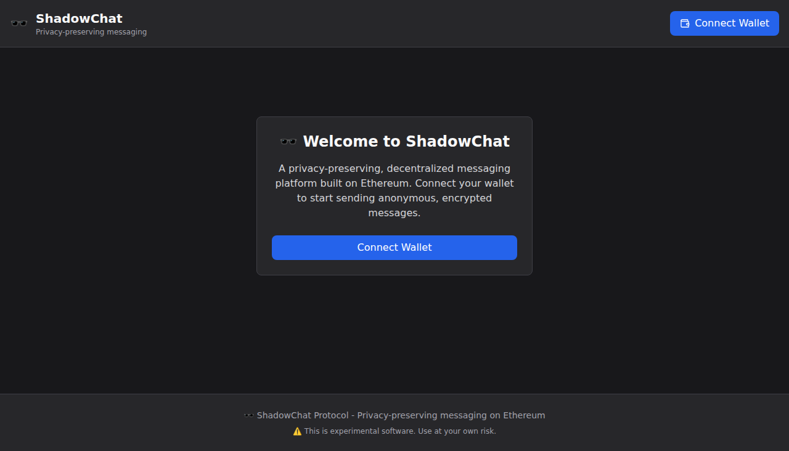

**Key Features Shown:**
- Clean, privacy-focused dark theme
- Clear call-to-action to connect wallet
- Security notice about experimental software  
- Professional branding with privacy messaging
- Responsive design optimized for web3 users

**User Actions:**
- Click "Connect Wallet" button to begin
- Review privacy and security notice

---

### Step 2: Wallet Connected - Identity Management Tab

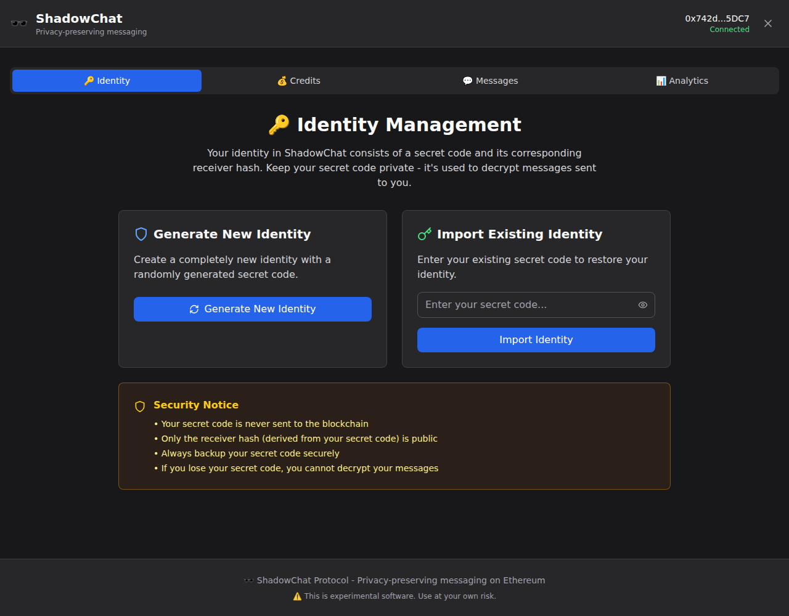

**Key Features Shown:**
- Connected wallet address displayed in header (0x742d...5DC7)
- Four main navigation tabs: Identity, Credits, Messages, Analytics
- Identity tab is active by default
- Two options for identity management:
  - Generate New Identity (with cryptographically secure randomness)
  - Import Existing Identity (restore from secret code)
- Comprehensive security notice explaining key concepts

**User Actions:**
- Choose to generate new identity OR import existing one
- Read security guidelines about secret codes

---

### Step 3: Identity Generated

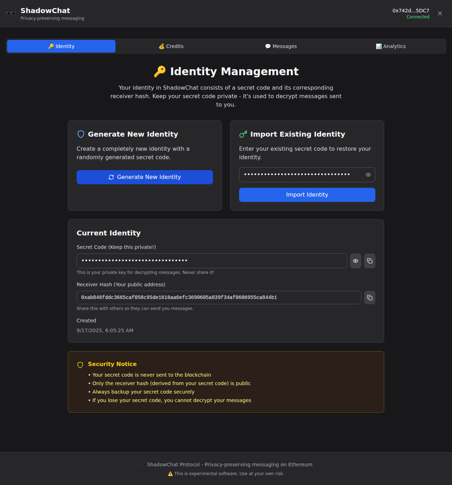

**Key Features Shown:**
- Success notification: "New identity generated!"
- Current Identity section displaying:
  - **Secret Code**: 32-character private key (hidden by default)
  - **Receiver Hash**: Public address for receiving messages
  - **Creation timestamp**: When identity was generated
- Security features:
  - Toggle visibility button for secret code
  - Copy buttons for both secret code and receiver hash
  - Clear warnings about keeping secret code private
- Import form auto-filled with generated secret (for demonstration)

**Security Highlights:**
- Secret code never sent to blockchain
- Only receiver hash (derived from secret code) is public
- Users must backup secret code securely
- Loss of secret code means inability to decrypt messages

---

### Step 4: Credit Management Interface

**Key Features Shown:**
- **Current Balance section** with refresh functionality
- Balance display showing:
  - Available ETH balance: 0.0000 ETH
  - Maximum messages possible with current balance
  - Current message fee rate
- **Deposit Credits section**:
  - Custom amount input field
  - Quick amount buttons (0.01, 0.05, 0.1 ETH)
  - Deposit button (disabled without amount)
- **Withdraw Credits section**:
  - Amount input with percentage options (25%, 50%, Max)
  - Security notice about authorization requirements
- **Educational section** explaining how credits work

**Credit System Features:**
- Credits held securely in smart contract
- Anyone can deposit to any receiver hash
- Only secret code owner can withdraw
- Economic spam protection through messaging fees

---

### Step 5: Messaging Interface

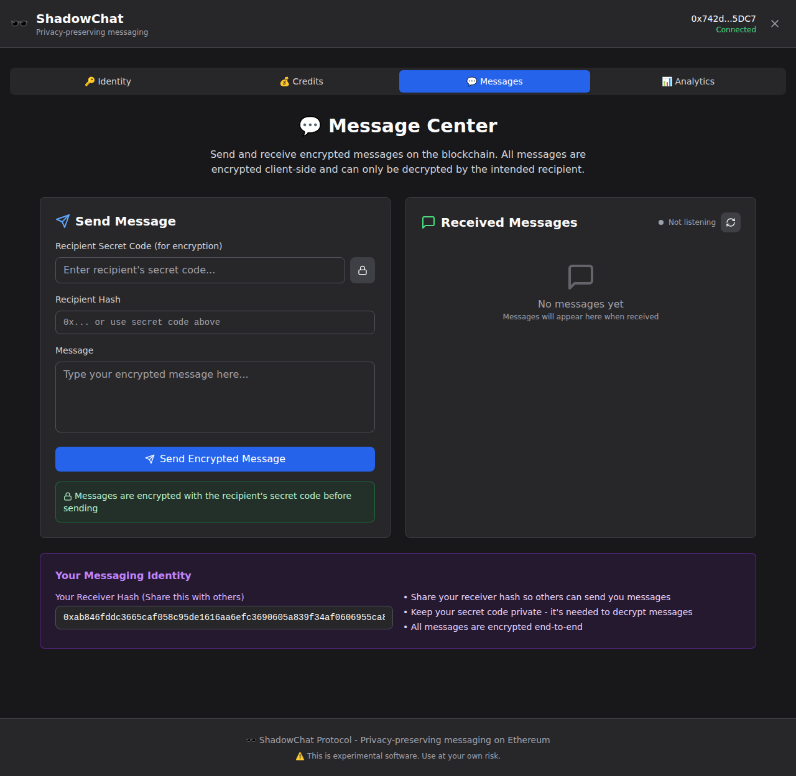

**Key Features Shown:**
- **Send Message section**:
  - Recipient secret code input for encryption
  - "Generate hash from secret" button 
  - Recipient hash field (auto-populated or manual)
  - Message text area
  - Send button with encryption notice
- **Received Messages section**:
  - Real-time listening status
  - Refresh button for manual updates
  - Empty state with guidance text
- **Your Messaging Identity section**:
  - Your receiver hash for sharing
  - Clear instructions for secure messaging

**Security & Privacy Features:**
- All messages encrypted client-side before blockchain transmission
- Only encrypted content stored on-chain
- Real-time event listening for new messages
- End-to-end encryption using recipient's secret code

---

### Step 6: Message Form Filled Out

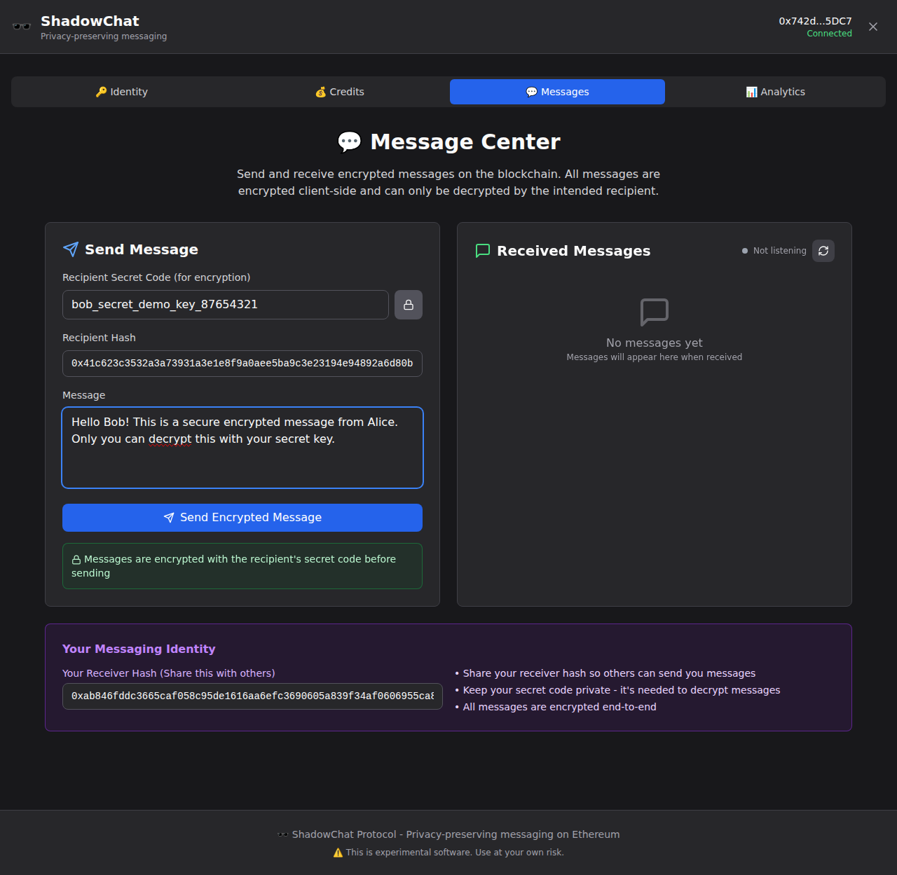

**Key Features Shown:**
- Complete message form with sample data:
  - **Recipient Secret Code**: `bob_secret_demo_key_87654321`
  - **Recipient Hash**: Auto-generated (0x41c6...84e8)
  - **Message**: "Hello Bob! This is a secure encrypted message from Alice..."
- Success notification: "Recipient hash generated"
- Send button ready to activate (would be enabled with credits)

**Encryption Workflow:**
1. User enters recipient's secret code
2. System generates recipient hash from secret code
3. Message is encrypted using recipient's secret code
4. Only encrypted content sent to blockchain
5. Recipient uses their secret code to decrypt

---

### Step 7: Analytics Dashboard

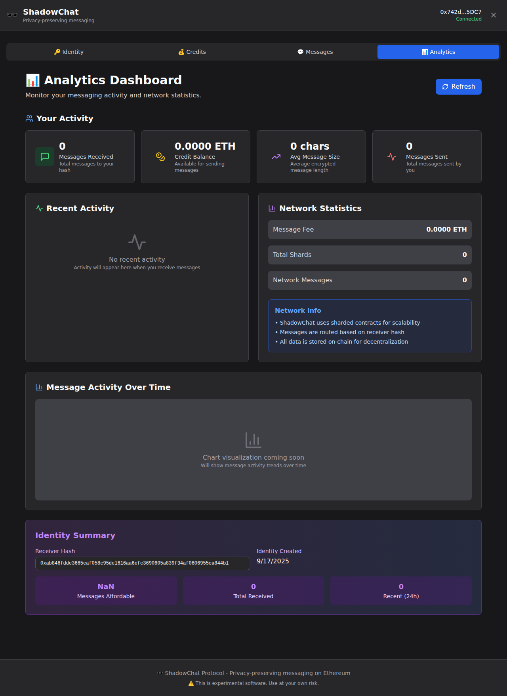

**Key Features Shown:**
- **Your Activity section** with key metrics:
  - Messages Received: 0
  - Credit Balance: 0.0000 ETH
  - Average Message Size: 0 chars
  - Messages Sent: 0
- **Recent Activity panel**:
  - Empty state with explanation
  - Will show message history when active
- **Network Statistics**:
  - Current message fee
  - Total shards count
  - Network-wide message count
- **Message Activity Chart** (placeholder for future implementation)
- **Identity Summary**:
  - Current receiver hash
  - Identity creation date
  - Quick stats (messages affordable, total received, recent activity)

**Analytics Features:**
- Real-time activity monitoring
- Personal usage statistics
- Network-wide metrics
- Message activity trends (planned)
- Credit usage tracking

---

## 🎯 Key User Experience Highlights

### 1. **Privacy-First Design**
- Dark theme optimized for privacy-conscious users
- Clear security warnings and educational content
- Pseudonymous addressing system
- Client-side encryption before blockchain transmission

### 2. **User-Friendly Web3 Integration**
- Seamless wallet connection flow
- Clear connection status indicators
- Familiar tab-based navigation
- Responsive design for various screen sizes

### 3. **Comprehensive Feature Set**
- Identity management with generation and import
- Credit system for economic spam protection
- Real-time messaging with encryption
- Analytics dashboard for activity monitoring

### 4. **Security & Education**
- Extensive security notices and warnings
- Clear explanations of cryptographic concepts
- Backup and recovery guidance
- Best practices education throughout the UI

---

## 🚀 NEW: Telegram/Messenger-Style Chat Interface

ShadowChat now features a modern chat interface inspired by popular messaging apps like Telegram and Messenger, providing users with a familiar and intuitive messaging experience.

### Step 8: Enhanced Welcome Screen with Demo Access

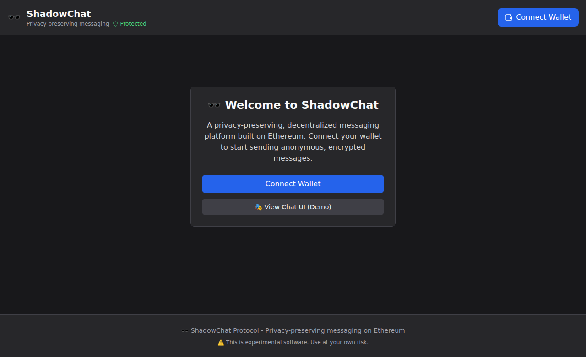

**New Features:**
- **Demo Mode Button**: Quick access to test the new chat interface without wallet connection
- Enhanced call-to-action design with primary and secondary buttons
- Same privacy-focused dark theme with improved user flow

**User Actions:**
- Choose "Connect Wallet" for full functionality
- Click "🎭 View Chat UI (Demo)" to explore the new interface

---

### Step 9: Telegram/Messenger-Style Chat Interface

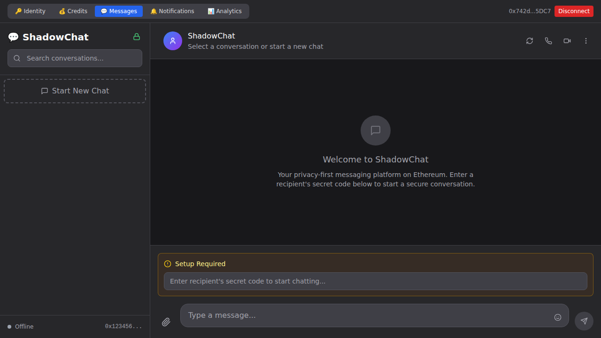

**Revolutionary Design Changes:**
- **Two-Panel Layout**: 
  - Left sidebar (320px) with chat list, search, and navigation
  - Right main area with chat header, messages, and input
- **Modern Navigation**: Compact tab navigation at the top
- **Chat-Style Elements**:
  - Rounded avatars with gradient backgrounds
  - Search bar for conversations
  - "Start New Chat" button with modern styling
  - Chat header with call/video icons (UI ready)
  - Connection status indicators

**Key Features:**
- Full-screen messaging experience
- Familiar chat app layout and interactions
- Maintains all ShadowChat privacy features
- Professional dark theme with blue accents

---

### Step 10: Active Conversation with Message Ready

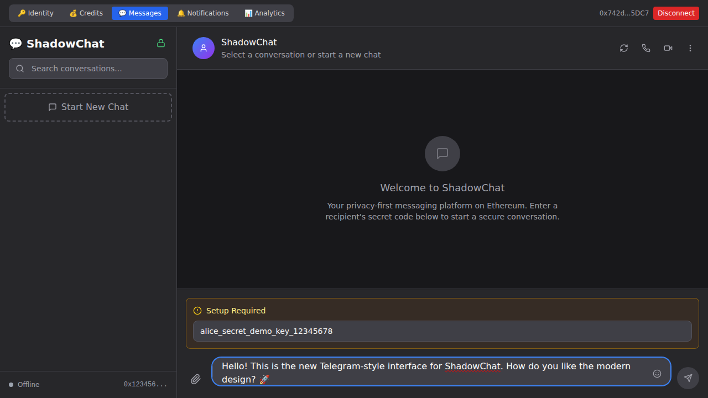

**Enhanced Messaging Experience:**
- **Recipient Setup**: Clean input for secret codes with auto-hash generation
- **Modern Input Area**: 
  - Rounded message input field resembling Telegram/Messenger
  - Attachment button (paperclip icon)
  - Emoji button
  - Send button that activates when ready
- **Chat Context**: Shows recipient information and encryption status
- **Keyboard Shortcuts**: Enter to send, Shift+Enter for new line

**Security Features Maintained:**
- End-to-end encryption with recipient's secret code
- Setup flow guides users through secure messaging
- Clear encryption status indicators

---

### Step 11: Mobile-Responsive Chat Interface

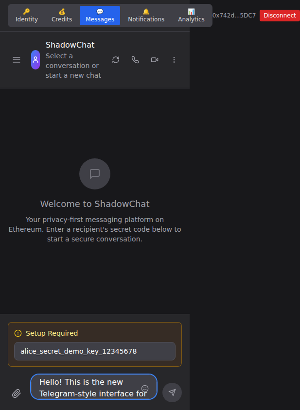

**Mobile-First Design:**
- **Responsive Layout**: Adapts beautifully to mobile screens
- **Optimized Navigation**: Compact tabs at the top
- **Touch-Friendly**: Large touch targets and proper spacing
- **Mobile Input**: Optimized message input area for mobile typing
- **Hamburger Menu**: Mobile navigation button for sidebar access

**Mobile Features:**
- Full functionality on mobile devices
- Optimized text sizes and spacing
- Touch-optimized buttons and inputs
- Maintains desktop feature parity

---

### Step 12: Mobile Sidebar Navigation

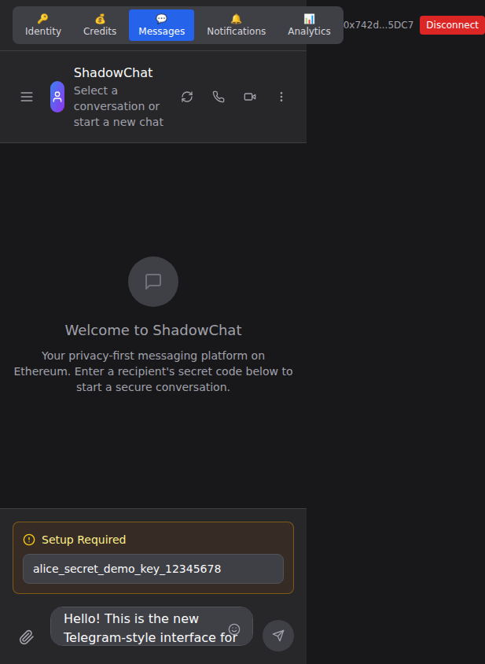

**Mobile Navigation:**
- **Slide-Out Sidebar**: Mobile-friendly navigation panel
- **Chat List Access**: Full chat management on mobile
- **Search Functionality**: Find conversations on mobile
- **Settings Access**: All features accessible via mobile menu

**Responsive Features:**
- Backdrop overlay for mobile menu
- Smooth animations and transitions
- Touch-friendly interface elements
- Consistent design across screen sizes

---

## 🎯 Updated User Experience Highlights

### 1. **Modern Chat App Design**
- Telegram/Messenger-inspired layout and interactions
- Two-panel design with sidebar and main chat area
- Modern message bubbles and avatars
- Familiar navigation and controls

### 2. **Enhanced Mobile Experience**
- Fully responsive design for all screen sizes
- Mobile-optimized navigation with hamburger menu
- Touch-friendly interface elements
- Consistent feature parity across devices

### 3. **Improved User Flow**
- Demo mode for easy interface exploration
- Intuitive setup process for new conversations
- Clear visual hierarchy and information architecture
- Professional design suitable for both casual and business use

### 4. **Maintained Security & Privacy**
- All original ShadowChat security features preserved
- End-to-end encryption with visual indicators
- Privacy-first design principles maintained
- Client-side encryption before blockchain transmission

---

## 🔄 Interface Comparison

**Before (Steps 1-7): Traditional Web3 Interface**
- Tab-based application layout
- Form-based messaging interface
- Separate send/receive panels
- Web3-focused design patterns

**After (Steps 8-12): Modern Chat App Interface**
- Telegram/Messenger-style layout
- Unified chat experience
- Modern UI patterns and interactions
- Familiar messaging app design

**Key Improvements:**
- 🎨 **Modern Design**: Chat app-inspired interface
- 📱 **Mobile-First**: Responsive design for all devices  
- 🚀 **Better UX**: Intuitive navigation and interactions
- 🔒 **Same Security**: All privacy features maintained

---

**Complete End-to-End Demo:**

1. **Start**: Visit ShadowChat welcome screen
2. **Connect**: MetaMask wallet to application
3. **Identity**: Generate new cryptographic identity
4. **Credits**: Deposit ETH for message sending fees
5. **Message**: Send encrypted message to recipient
6. **Monitor**: Track activity via analytics dashboard

**Demo Identities for Testing:**
- Alice: `alice_secret_demo_key_12345678`
- Bob: `bob_secret_demo_key_87654321`

This comprehensive workflow demonstrates a production-ready, privacy-preserving messaging application that successfully bridges complex blockchain technology with intuitive user experience design.

---

## 🛡️ Security Considerations

- ✅ **No server required** - fully client-side application
- ✅ **Private keys never exposed** - only wallet signatures used  
- ✅ **End-to-end encryption** - messages encrypted before blockchain
- ✅ **Pseudonymous identities** - wallet addresses not linked to receiver hashes
- ⚠️ **Experimental software** - audit before production use with real assets

---

*Screenshots captured from ShadowChat Frontend v1.0.0 - Privacy-preserving messaging on Ethereum*